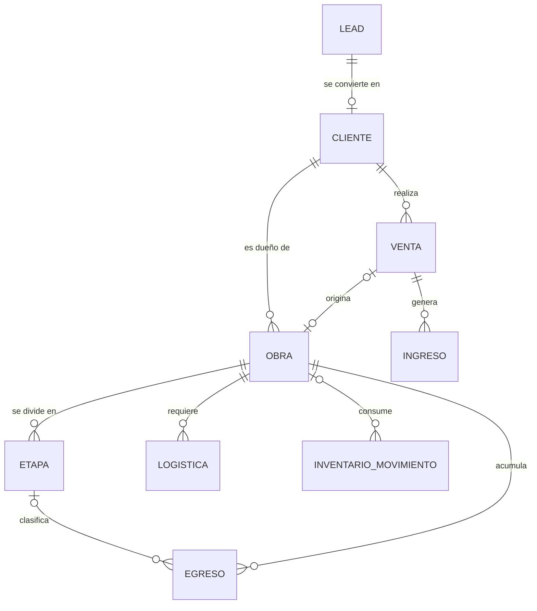

# PLAN.md — CRM de Ventas, Logística y Obra

> Este archivo es la **fuente de verdad del plan**: objetivo, alcance, decisiones, arquitectura, fechas y riesgos. Lo leen Héctor, Carolina y las IAs que los ayudan.
> Las tareas de desarrollo están en `TAREAS.md` y sus criterios de aceptación en `CHECKLIST_ENTREGA.md`. Aquí no hay tareas de código.
> Generado el 2026-10-01 a partir de la conversación de planeación. Etiquetas: **Confirmado** (lo dijo el equipo explícitamente) · **Propuesta** (recomendación sin aprobación explícita) · **Por confirmar** (aún no definido).

---

## 1. Objetivo

Construir un CRM a medida para **ventas, procesos logísticos y de obra**, de uso interno para un solo negocio. Se empieza desde cero, sin código previo. **Confirmado.**

El uso futuro como base para otro giro de negocio es solo una idea futura y **no es prioridad**: no se diseña para ello ahora. **Confirmado.**

Nombre del producto: "Turistarán" aparece en el HTML de referencia. **Por confirmar** si es el nombre oficial.

## 2. Alcance

### Dentro de alcance: 9 módulos (Confirmado)
Leads · Clientes · Ventas · Egreso · Ingreso · Avance de obra · Logística · Inventario · Ahorro

Se construyen en este orden de pilares (**Confirmado**):

| Orden | Pilar | Módulos |
|---|---|---|
| 1 | Comercial | Leads, Clientes, Ventas |
| 2 | Financiero | Ingreso, Egreso, Ahorro |
| 3 | Operación | Avance de obra, Logística, Inventario |

### Definiciones de módulo dadas por el equipo (Confirmado)
- **Ahorro:** página con una tabla de todos los proyectos con datos generales, resaltando el **presupuesto** y **lo que finalmente se gastó**. El ahorro acumulado (ganancia total de todas las obras) se muestra en el apartado principal (dashboard).
- **Avance de obra:** porcentaje de avance por etapa y datos básicos sobre gastos. El resto del detalle ("y cosas así") está **Por confirmar** (ver decisión D-14).

### Fuera de alcance hasta decisión (Por confirmar, D-12)
El HTML de referencia ("Turistarán ERP & CRM") incluye elementos que **no están** en los 9 módulos: RH (Personal, Asistencias, Contrataciones, Vacaciones/Permisos, Nómina), Contabilidad, Cuentas por cobrar y por pagar, Costeo, Proyecciones, Auditoría, Roles y permisos, Proveedores, Solicitudes y Órdenes de compra, Recepciones, 3-Way Matching y Cotizaciones. Mientras D-12 no se resuelva, se consideran **fuera de alcance** y el HTML se usa solo como referencia visual.

## 3. Equipo y reparto

**Confirmado:** el equipo son **Héctor** y **Carolina**. Trabajan entre 2 y 3 días por semana, el proyecto es de baja prioridad y no tiene fecha límite fija.

**Confirmado (D-09):** cada tarea tiene **una sola persona responsable** (ninguna tarea es de "ambos") y lo más difícil se asigna a **Héctor**.

**Propuesta:** la dificultad de cada tarea la estimó el coordinador con este criterio:
- **Alta:** infraestructura crítica o lógica de negocio compleja (esquema de base de datos, autenticación, crear una Obra automáticamente desde una Venta, cálculo de ahorro, avance de obra).
- **Media:** CRUD con alguna regla propia o integración entre módulos.
- **Baja:** CRUD estándar o pantalla simple.

Resultado del reparto (detalle en `TAREAS.md`):

| Persona | Tareas | Dificultad alta | Dificultad media | Dificultad baja | Por definir |
|---|---|---|---|---|---|
| Héctor | 9 | 5 | 3 | 1 | 0 |
| Carolina | 9 | 0 | 3 | 4 | 2 |

Cada persona construye de punta a punta (backend y frontend) los módulos que tiene asignados, salvo en Ahorro, que se divide: Héctor hace el cálculo y Carolina las pantallas. Los conocimientos técnicos de cada persona están **Por confirmar**; si alguna tarea no se ajusta, se reasigna dejando constancia en `TAREAS.md`.

## 4. Decisiones

| ID | Decisión | Estado | Bloquea |
|---|---|---|---|
| D-01 | Sistema mono-tenant (un solo negocio). Sin capas multi-cliente. | Confirmado | — |
| D-02 | Aplicación web responsiva para móvil y desktop. Sin app nativa. | Confirmado | — |
| D-03 | Orden de construcción: Comercial → Financiero → Operación. | Confirmado | — |
| D-04 | Sin fecha límite fija; 2–3 días/semana de dedicación. | Confirmado | — |
| D-05 | Ahorro es una **vista calculada**, no una tabla de captura. | Confirmado (definición) / Propuesta (implementación) | — |
| D-06 | **Egreso es la única fuente de verdad de gastos.** Avance de obra y Ahorro solo consultan egresos filtrados por `obra_id`/`etapa_id`. | Propuesta | T-12, T-14, T-16 |
| D-07 | Stack: React (frontend), Node.js + Express (backend), PostgreSQL. | Propuesta | T-02, T-05 |
| D-08 | Un repositorio Git con ramas por módulo (`feature/<modulo>`). Convención de ramas y commits en `CLAUDE.md`, sección 6.1. | Confirmado por Héctor (2026-10-01) | — |
| D-09 | Una sola persona responsable por tarea; lo más difícil a Héctor. | Confirmado | — |
| D-10 | Checkpoint semanal fijo aunque no haya fecha límite externa. Día por definir. | Propuesta | — |
| D-11 | Estilo visual del dashboard. Hay dos propuestas publicadas (Duolingo y Revolut). | Por confirmar | T-05 |
| D-12 | Alcance del HTML de referencia: ¿solo maqueta o amplía el proyecto? | Por confirmar | Alcance y estimaciones |
| D-13 | Modelo de entidades de la sección Arquitectura aprobado por Héctor y Carolina. | Propuesta | T-03 |
| D-14 | Alcance exacto de Avance de obra (lista cerrada de datos y pantallas), congelado antes de construirlo. | Por confirmar | T-16 |

### Registro de decisiones

- **2026-10-01 · D-08:** Héctor confirmó el acceso de Carolina y la convención de ramas por módulo y commits `feat:`, `fix:` y `docs:`. Se confirma la propuesta para cerrar T-01. Los cambios se preparan localmente en `codex/fundacion-repositorio`; el papel de la rama existente `Dev` sigue por confirmar. D-07 y las demás decisiones conservan su estado.

## 5. Arquitectura

### 5.1 Diagrama de entidades (Propuesta)

### 5.2 Entidades y campos (Propuesta)

| Entidad | Campos |
|---|---|
| Lead | id, nombre, telefono/email (al menos uno), origen (referido/redes/llamada fría/otro), estado (nuevo/contactado/en negociación/convertido/perdido), responsable_id (FK Usuario), fecha_creacion, notas |
| Cliente | id, nombre/razón social, contacto, direccion, lead_origen_id (FK Lead, null), fecha_alta |
| Venta | id, cliente_id, obra_id (null), monto, estado (cotizada/confirmada/cancelada), fecha, descripcion |
| Obra | id, nombre, cliente_id, venta_id (null), **presupuesto**, estado (planeada/en progreso/pausada/terminada), fecha_inicio, fecha_fin_estimada |
| Etapa | id, obra_id, nombre (ej. cimentación/estructura/acabados), orden, porcentaje_avance (0–100) |
| Egreso | id, obra_id (null), etapa_id (null), monto, categoria (materiales/mano de obra/logística/administrativo), fecha, descripcion |
| Ingreso | id, venta_id (null), monto, concepto, fecha |
| Logística | id, obra_id, tipo (transporte/entrega/requisición), estado (pendiente/en tránsito/completado), fecha |
| Inventario (movimiento) | id, item_nombre, cantidad, unidad, obra_id (null), tipo_movimiento (entrada/salida), fecha |
| Usuario | **Por definir** (lo usan Lead.responsable_id y el login) |

### 5.3 Reglas de negocio
1. Egreso es la única fuente de gastos. Ningún otro módulo captura gastos por su cuenta. (D-06, Propuesta)
2. `Ahorro(obra) = Obra.presupuesto − SUM(Egreso.monto WHERE obra_id = obra.id)`. El dashboard principal suma el ahorro de todas las obras. (D-05)
3. Un Lead se convierte en Cliente conservando `lead_origen_id`; el Lead no se borra. (Propuesta)
4. Una Venta puede o no generar una Obra; solo las ventas de construcción/obra la generan. (Propuesta)
5. Un Egreso puede no tener obra (egresos generales del negocio); la Etapa es opcional. (Propuesta)

### 5.4 Puntos de arquitectura Por confirmar (hay que cerrarlos antes de T-03)
- Tipo de clave primaria (UUID o entero).
- `Venta.obra_id` y `Obra.venta_id` existen en ambos sentidos: definir qué lado guarda la relación para evitar inconsistencias.
- Inventario: ¿`item_nombre` libre o catálogo de materiales?
- Campos de la entidad Usuario y si habrá roles (por ahora, login básico para 2 usuarios).
- Moneda y formato numérico (el HTML de referencia usa `$`).
- Contenido mínimo del dashboard principal en las primeras fases.

## 6. Fases, fechas y camino crítico

Duraciones estimadas (**Propuesta**), con buffer de 20% por complejidad y ritmo de 2–3 días/semana entre 2 personas:

| Hito | Fase | Duración estimada | Tareas |
|---|---|---|---|
| Hito 0 | Fundación técnica | ~2 semanas | T-01 a T-06 |
| Hito 1 | Comercial (Leads, Clientes, Ventas) | 5–6 semanas | T-07 a T-11 |
| Hito 2 | Financiero (Egreso, Ingreso, Ahorro) | 4–6 semanas | T-12 a T-15 |
| Hito 3 | Operación (Avance de obra, Logística, Inventario) | 8–12 semanas (la más incierta) | T-16 a T-18 |

Total estimado: 5–6 meses a este ritmo (**Propuesta**).

**Fechas.** El calendario propuesto originalmente asumía arranque el 16 de septiembre de 2026. No hay evidencia de que haya empezado. **Fecha real de arranque: Por confirmar.** Las fechas se reprograman sumando las duraciones de arriba a partir del arranque real.

**Camino crítico (Propuesta, sale de las dependencias de `TAREAS.md`):**
`T-01 → T-02 → T-03 → T-04 → T-06 → T-07 → T-08 → T-09 → T-11 → T-12 → T-14 → T-15`, con la rama `T-12 → T-16`.
Ruta paralela: `T-01 → T-05 → T-06`.

## 7. Riesgos

| ID | Riesgo | Impacto | Mitigación |
|---|---|---|---|
| R-01 | Doble captura de gastos (Egreso vs. Avance de obra) | Datos financieros inconsistentes | Egreso como fuente única (D-06) |
| R-02 | Alcance de "Avance de obra" vago | Crecimiento descontrolado en el Hito 3 | Cerrar D-14 antes de iniciar T-16 |
| R-03 | Sin fecha límite y baja disponibilidad | Pérdida de impulso; el proyecto se estanca | Checkpoint semanal fijo (D-10) |
| R-04 | Dos personas, 9 módulos conectados | Conflictos de integración | Convención de repositorio (T-01) y un responsable por tarea (D-09) |
| R-05 | El HTML de referencia incluye módulos fuera de los 9 | Ampliación silenciosa del alcance | Resolver D-12; mientras tanto, fuera de alcance |
| R-06 | Héctor concentra las tareas más difíciles y el camino crítico | Cuello de botella si no está disponible | Revisar el reparto en cada checkpoint semanal |

## 8. Criterio de corte

**Por confirmar.** Propuesta de trabajo:
- Si el tiempo se acorta, se recorta primero el Hito 3 a un MVP fijo (% de avance por etapa y gastos por etapa consultados desde Egreso), sin funciones nuevas.
- Ningún módulo fuera de los 9 entra al plan sin una decisión registrada en este archivo.
- Un hito se cierra solo cuando se cumplen sus criterios en `CHECKLIST_ENTREGA.md`.

## 9. Pendientes de entrega final (Por confirmar)

El equipo aún no ha definido qué significa "entregado" para este proyecto. Falta decidir:
- Dónde se despliega el sistema (hosting/ambiente).
- Quién acepta la entrega y con qué criterios.
- Si hay datos iniciales o migración desde Excel/papel.
- Qué pruebas se exigen antes de dar el sistema por entregado.
- Qué documentación o capacitación necesitan quienes lo usen.

## 10. Referencias

- Especificación Fase 0 y Fase 1: https://claude.ai/artifact/BweRJJo523a6p51GSP3vC5
- Propuesta de diseño estilo Duolingo: https://claude.ai/artifact/9ZXR7neM3ZaPhxpADc7F9G
- Propuesta de diseño estilo Revolut: https://claude.ai/artifact/1vBG6M9YNZAV2JRFU6s4Zs
- HTML de referencia "Turistarán ERP & CRM" (capturas aportadas por el equipo).
